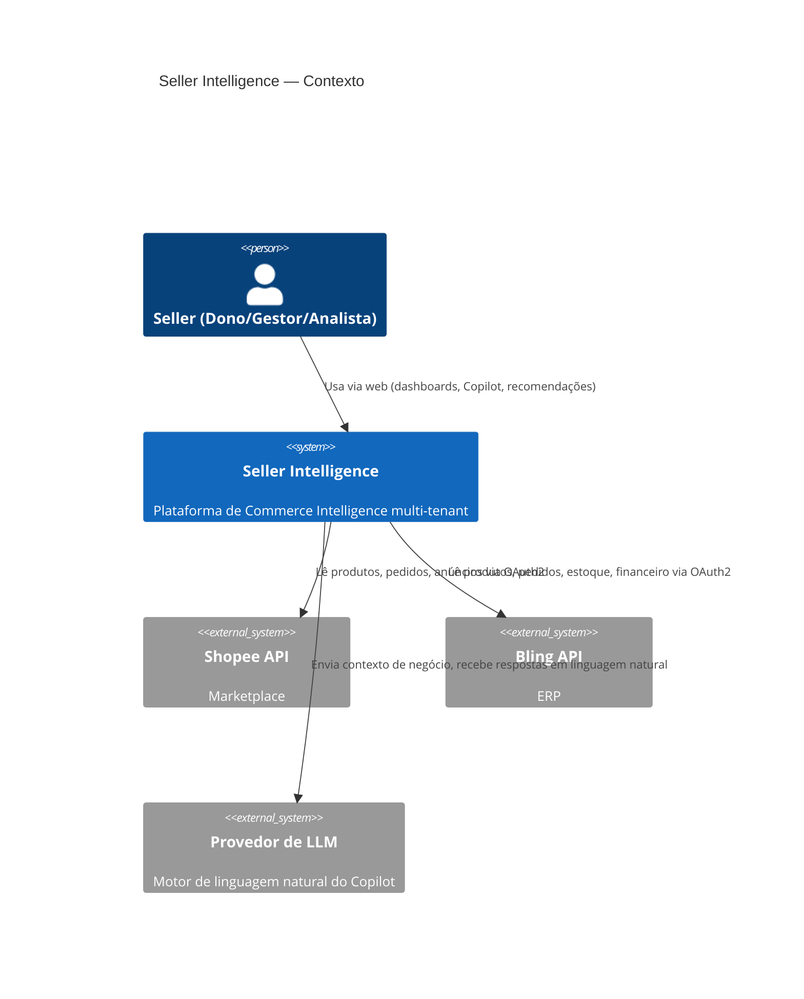
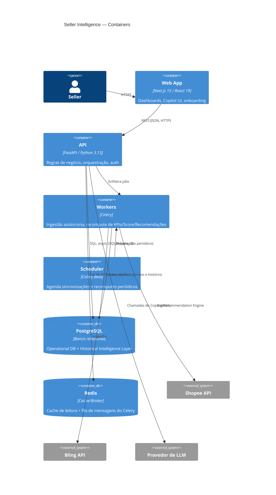

# Arquitetura do Sistema — Seller Intelligence

Relacionado: [01-product-vision.md](./01-product-vision.md) ·
[02-prd.md](./02-prd.md)

## 1. Princípios Arquiteturais

Toda decisão abaixo é avaliada contra estes princípios, na ordem:

1. **O Seller Intelligence Hub é o centro do domínio.** Ingestão (Shopee/Bling) é
   infraestrutura substituível; o Hub e seu histórico não podem depender da forma de uma
   fonte específica.
2. **Extensibilidade sem breaking change.** Adicionar marketplace/ERP novo = novo adapter,
   zero alteração em domínio/Hub.
3. **Isolamento multi-tenant em toda camada**, não só no banco.
4. **Manutenibilidade de longo prazo > velocidade de curto prazo** — cada escolha abaixo tem
   uma alternativa mais rápida de implementar hoje; quando não a escolhemos, a razão está
   explícita.
5. **Preparar para escala sem pagar o custo de microsserviços agora** — módulos isolados o
   suficiente para serem extraídos depois, rodando como monolito enquanto o time é pequeno.

## 2. Visão C4 — Nível 1: Contexto



## 3. Visão C4 — Nível 2: Containers



## 4. Estilo Arquitetural: Modular Monolith + DDD + Clean Architecture

**Decisão:** um único deployable de backend (o container `api` + `worker` compartilhando o
mesmo código-fonte), internamente dividido em **módulos por bounded context** (ver
[06-modules.md](./06-modules.md)), cada módulo estruturado em camadas Clean Architecture.

**Alternativas consideradas:**
- *Microsserviços desde o MVP* — rejeitado. Com uma equipe pequena e domínio ainda em
  validação (personas, KPIs e até o modelo canônico de produto podem mudar nos primeiros
  meses), o custo operacional de N deployables, N pipelines de CI/CD, tracing distribuído e
  consistência eventual entre serviços supera o benefício. Errar o boundary de um módulo
  dentro de um monolito custa um refactor; errar o boundary de um microsserviço custa uma
  migração de dados entre bancos distintos.
- *Monolito não-modular ("big ball of mud")* — rejeitado. Viola o princípio de
  extensibilidade: sem fronteiras internas claras, adicionar um marketplace tende a espalhar
  `if shopee / if bling` pelo código em vez de isolar em adapters.
- **Modular Monolith (escolhido)** — mantém o custo operacional de um único deployable,
  mas força fronteiras de módulo via DDD, preparando extração futura: cada módulo já se
  comunica com os demais apenas por interfaces explícitas e eventos de domínio (seção 6),
  nunca por acesso direto a tabelas de outro módulo. Extrair um módulo para um serviço
  próprio no futuro (candidato natural: `ingestion` ou `copilot`, por volume/custo de
  processamento) se torna um exercício de infraestrutura, não de reescrita de domínio.

### 4.1 Camadas por módulo (Clean Architecture)

```
module/
├── domain/            # Entidades, Value Objects, regras de negócio puras — zero dependência externa
├── application/        # Casos de uso (Service Layer), orquestram domínio + repositórios via interfaces
├── infrastructure/      # Implementações concretas: SQLAlchemy repositories, clients HTTP, Celery tasks
└── interface/           # Camada de entrada: routers FastAPI (REST), schemas Pydantic de request/response
```

Regra de dependência (Dependency Rule): `interface` e `infrastructure` dependem de
`application`, que depende de `domain`. `domain` não importa nada de fora de si mesmo.
Isso é o que torna o **Repository Pattern** e a **Dependency Injection** obrigatórios: a
camada `application` depende de uma *interface* de repositório (definida em `domain` ou
`application`), e é a `infrastructure` que injeta a implementação concreta (SQLAlchemy) via
DI (FastAPI `Depends`) — permitindo trocar a implementação (ex.: cache, outro banco, mock em
teste) sem tocar em regra de negócio.

## 5. Ports & Adapters para Integrações Externas

Cada fonte externa (Shopee, Bling, e futuramente Mercado Livre, Amazon, Tiny etc.) é isolada
atrás de uma **porta** (interface) definida no domínio de ingestão, com um **adapter**
concreto por fonte:

```
IngestionPort (interface)
├── ShopeeAdapter    (implementa IngestionPort para Shopee API)
├── BlingAdapter     (implementa IngestionPort para Bling API)
└── <NovoMarketplace>Adapter   (futuro — mesma interface, zero mudança no domínio)
```

A porta expõe operações no vocabulário do domínio (`fetch_products()`, `fetch_orders()`,
`fetch_inventory()`), nunca no vocabulário da API externa. A tradução do formato específico
de cada fonte para o **modelo canônico** (PRD, seção 4) acontece dentro do adapter, na etapa
de **Data Normalization** do pipeline (seção 7). Isso é o mecanismo concreto por trás do
RNF07 (extensibilidade sem breaking change): o domínio nunca sabe que "Shopee" ou "Bling"
existem, apenas consome `IngestionPort`.

## 6. Comunicação entre Módulos: Domain Events via Transactional Outbox

Módulos não chamam repositórios de outros módulos diretamente. Comunicação entre bounded
contexts acontece por:

1. **Chamada síncrona via interface de Application Service** quando o módulo chamador
   precisa de uma resposta imediata (ex.: API consultando o `IntelligenceHubService` para
   montar um dashboard).
2. **Domain Events assíncronos** quando um módulo apenas precisa notificar que algo
   aconteceu, sem bloquear (ex.: `OrderIngested`, `ProductPriceChanged`,
   `InventoryLevelChanged`).

### 6.1 Problema com o bus in-process ingênuo (revisado após Architecture Review, R1)

A versão original deste documento publicava o evento diretamente em memória logo após o
`commit` da transação que alterou o agregado. Isso tem uma falha real: se o processo morrer
(crash, deploy, OOM) **entre o commit no banco e a publicação em memória**, o evento se
perde para sempre — a escrita no agregado aconteceu, mas nada reage a ela. Como o Seller
Intelligence Hub inteiro (KPI, Score, Recommendation, Copilot) depende de reagir a eventos
para se manter atualizado, essa perda é silenciosa e só aparece quando um número já está
errado na tela do cliente.

### 6.2 Decisão: Transactional Outbox

Todo Aggregate Repository que produz Domain Events grava, **na mesma transação de banco**
que persiste o agregado, uma linha em uma tabela `outbox_event` (schema `platform`,
compartilhada por todos os módulos — é infraestrutura transversal, não pertence a um
bounded context específico):

```
platform.outbox_event
├── id                uuid PK
├── tenant_id         uuid
├── aggregate_type     string   ("Order", "InventoryLevel", ...)
├── aggregate_id       uuid
├── event_type         string   ("OrderConsolidated", "ProductPriceChanged", ...)
├── event_schema_version int    (ver seção 6.4)
├── payload            jsonb
├── created_at          timestamptz
├── published_at        timestamptz nullable   (null = ainda não publicado)
└── attempts            int default 0
```

Como `outbox_event` é escrita na **mesma transação SQL** que a tabela de domínio (ex.:
`core.order`), a garantia é atômica por construção: ou os dois commitam juntos, ou nenhum
commita — não existe mais o estado intermediário "agregado salvo, evento perdido".

Um **Outbox Relay** (processo Celery Beat dedicado, de baixa latência — poll a cada 1-2s)
lê linhas com `published_at IS NULL`, publica no event bus in-process (que dispara os
handlers/consumidores do MVP), e marca `published_at` após confirmação de entrega. Falha de
publicação incrementa `attempts` e tenta novamente (backoff), nunca descarta silenciosamente.

**Por que não usar Debezium/CDC (Change Data Capture) direto do WAL do Postgres**, que
eliminaria a tabela de outbox: rejeitado para o MVP por custo operacional (exige Kafka
Connect ou equivalente rodando e monitorado) desproporcional ao volume atual — o Outbox
Relay via polling é suficiente e trivial de operar com a stack já escolhida. Fica registrado
como a evolução natural quando o volume de eventos justificar (ver seção 16).

### 6.3 Idempotência do lado do consumidor

Entrega é **at-least-once** (o Relay pode publicar o mesmo evento duas vezes em cenários de
falha/retry) — todo handler consumidor é obrigado a ser idempotente, verificando
`event_id` contra uma tabela/registro de eventos já processados antes de agir (padrão
"Inbox" no lado do consumidor, espelhando o Outbox do produtor). Isso é particularmente
crítico para o handler de recompute do Hub (seção 9.1) e para o `AuditService`.

### 6.4 Versionamento de Schema de Evento

Cada evento carrega `event_schema_version`. Consumidores só processam versões que
reconhecem; uma mudança breaking no payload de um evento (ex.: renomear campo) incrementa a
versão e o produtor pode, durante uma janela de transição, publicar ambas as versões. Esse
requisito é desenhado agora — mesmo com bus in-process — porque é exatamente o tipo de
disciplina que, se ausente, transforma uma futura extração para microsserviços em
redesenho de contrato em vez de troca de transporte (ver seção 16).

**Justificativa geral:** eventos de domínio desacoplam produtores de consumidores — o
módulo de Ingestão não precisa saber que o Hub existe, apenas publica `OrderIngested` via
Outbox. Isso mantém a mesma forma de comunicação que seria usada entre microsserviços
(mensagens assíncronas, at-least-once, idempotentes, versionadas), só que hoje via
tabela de outbox + bus in-process em vez de um broker distribuído — reduzindo o custo de
uma eventual extração futura para "trocar o transporte", não "redesenhar a comunicação".

## 7. Pipeline da Intelligence Layer (implementação)

Retomando o fluxo conceitual do PRD (seção 3), cada etapa mapeia para um componente concreto:

| Etapa (PRD) | Componente técnico |
|---|---|
| Data Ingestion | `ShopeeAdapter` / `BlingAdapter` (Celery tasks agendadas + sob demanda) |
| Data Normalization | Mapeadores dentro de cada adapter → `Internal Product` / `Order` / etc. canônicos |
| Operational Database | Tabelas de estado atual no PostgreSQL (schema `core`) |
| Historical Intelligence Layer | Tabelas versionadas/append-only (schema `history`) — seção 8 |
| (transversal) Confiabilidade de eventos | `platform.outbox_event` + Outbox Relay (seção 6) — garante que toda etapa abaixo reage de forma confiável às anteriores |
| Seller Intelligence Hub | Módulo `intelligence` (Application Services: KPI, ABC/Pareto, Score, Recommendation, Copilot), com debounce de recompute (seção 9.1) |
| Dashboards / KPIs / AI / Automations | Endpoints REST do módulo `intelligence` consumidos pelo Next.js |

## 8. Historical Intelligence Layer — Desenho Técnico

**Decisão:** versionamento por **tabelas de histórico append-only** (padrão
"snapshot + validade"), não event sourcing completo.

Cada entidade historizável (Preço, Custo, Estoque, Margem, Campanha, Anúncio, Afiliado) tem:
- Uma tabela de **estado atual** (Operational DB) — leitura rápida do "agora".
- Uma tabela de **histórico** correspondente, append-only, com `valid_from`, `valid_to`
  (null = vigente) e `recorded_at` (quando o sistema capturou o dado) — permitindo tanto
  "qual era o preço em 1º de março" (tempo de negócio) quanto auditoria de quando o sistema
  soube disso (tempo de sistema), sem exigir o aparato completo de event sourcing (replay de
  eventos, snapshots de agregados).

**Alternativas consideradas:**
- *Event Sourcing completo* — rejeitado para o MVP: poder de expressão maior, mas exige
  infraestrutura de replay/projeções e eleva a curva de aprendizado do time sem benefício
  claro no MVP, já que o requisito real (RF10, RNF09) é "consultar estado em ponto do
  passado e nunca sobrescrever", não "reconstruir qualquer estado a partir de eventos brutos".
- *Apenas estado atual, sem histórico* — rejeitado: inviabiliza KPIs comparativos, curva
  ABC/Pareto ao longo do tempo, tendência do Seller Score e boa parte do Recommendation
  Engine (PRD, seção 7).

Detalhamento de tabelas e chaves no [04-database-erd.md](./04-database-erd.md). Estratégia
de retenção/particionamento (para conter crescimento indefinido do histórico) é revisitada
quando houver dados reais de volume — mitigação registrada como risco no PRD (seção 14).

## 9. Processamento Assíncrono e Filas (Celery)

Quatro categorias de job, todas fora do request/response síncrono da API, cada uma em uma
**fila Celery dedicada** — não uma fila genérica única:

| Fila | Categoria | Disparo |
|---|---|---|
| `sync.shopee` | Ingestão Shopee | Celery Beat (periódico) + manual (RF06) + webhook |
| `sync.bling` | Ingestão Bling | Celery Beat (periódico) + manual (RF06) + webhook |
| `recompute` | Recompute de Inteligência | Outbox Relay → Domain Event (com debounce, seção 9.1) |
| `copilot` | Fallback assíncrono do Copilot | Requisição do usuário quando a agregação é pesada |

**Por que filas segregadas por fila/provider e não um pool genérico "ingestão":** rate
limit e instabilidade são *por provider* (seção 11). Se `sync.shopee` e `sync.bling`
competissem pela mesma fila/workers que uma fila genérica de "ingestão", um provider em
backoff agressivo consumiria capacidade de worker que deveria continuar processando o outro
provider normalmente. Filas separadas + pools de worker dimensionados por fila isolam essa
falha (achado da Architecture Review, seção 6 do documento `15-architecture-review.md`).

### 9.1 Debounce/Coalescing do Recompute de Inteligência

**Problema (Architecture Review, R5):** publicar um job de recompute para *cada* Domain
Event individual (`OrderConsolidated`, `MarginCalculated`, `InventoryLevelChanged`, ...) não
escala para um tenant com alto volume de pedidos — um tenant processando milhares de pedidos
por dia geraria milhares de jobs de recompute, majoritariamente redundantes (o KPI do dia só
precisa ser recalculado uma vez, não uma vez por pedido).

**Decisão:** o handler que reage a esses eventos não enfileira o recompute diretamente — ele
marca `(tenant_id, scope)` como "sujo" (dirty) em Redis com uma janela de debounce (ex.: 60s):

1. Primeiro evento do lote marca a chave `dirty:{tenant_id}:{scope}` e agenda um job Celery
   com `countdown=60s` (`recompute` fica na fila, mas só executa após a janela).
2. Eventos subsequentes dentro da janela apenas atualizam a marca "suja" (idempotente,
   `SETNX`-like) — **não** agendam um novo job, pois um já está pendente para essa chave.
3. Ao disparar, o job de recompute lê o estado atual (não o evento específico que o
   originou) e recalcula o escopo afetado — correto mesmo que dezenas de eventos tenham
   se acumulado na janela.

Esse padrão de **coalescing por chave com job único pendente** limita o recompute a, no
pior caso, uma execução por `(tenant, escopo)` por janela de 60s, independente do volume de
eventos — trade-off aceito: KPI/Score podem ficar até 60s desatualizados após um pedido,
compatível com o produto (não é um sistema de trading em tempo real).

## 10. Topologia do Redis (Cache, Broker e Result Backend)

**Problema (Architecture Review, R2):** Redis tem uma única `maxmemory-policy` **por
instância**, não por banco lógico (`SELECT N`). Se cache (que deve poder ser evictado sob
pressão de memória — é o próprio propósito de um cache) e broker do Celery (que **nunca**
pode perder uma mensagem enfileirada) dividem a mesma instância física, qualquer política de
eviction segura para o cache é perigosa para o broker, e vice-versa. Usar bancos lógicos
diferentes (`REDIS_DB=0` vs `REDIS_DB=1`) não resolve isso — a política de memória é da
instância inteira.

**Decisão:** duas instâncias Redis físicas distintas desde o MVP:

| Instância | Responsabilidade | `maxmemory-policy` | Persistência |
|---|---|---|---|
| `redis-broker` | Celery broker **+** result backend | `noeviction` | AOF habilitado (durabilidade da fila) |
| `redis-cache` | Cache de leitura da API (dashboards, sessão) | `allkeys-lru` | Nenhuma (perda é aceitável por definição) |

**Por que broker e result backend compartilham a mesma instância** (em vez de três
instâncias): a maioria das tasks (`sync.*`, `recompute`) usa `ignore_result=True` — o
resultado da execução não importa, o efeito relevante é o Domain Event publicado via Outbox
e o estado gravado no banco, não o valor de retorno do Celery. Apenas a fila `copilot`
(fallback assíncrono) efetivamente consulta um resultado, e seu volume é baixo o
suficiente para não justificar uma terceira instância no MVP. Result backend e broker
compartilham a característica de "não pode ser evictado sem causar mau funcionamento", o
que os torna compatíveis na mesma instância — cache é a única responsabilidade
genuinamente incompatível com as outras duas, e é ela que fica isolada.

**Gatilho para revisitar (3ª instância):** se o volume/tamanho de resultados retidos (ex.:
payloads grandes de recompute que passem a usar result backend) crescer a ponto de competir
por memória com o broker, separar `redis-result-backend` em instância própria — mudança de
configuração, não de código (URL de broker/backend é config, `infrastructure/`).

### 10.1 Topologia em Docker Compose / AWS

| Local (Compose) | AWS (futuro) |
|---|---|
| `redis-broker` (container) | ElastiCache Redis — cluster dedicado, AOF/persistência habilitada |
| `redis-cache` (container) | ElastiCache Redis — cluster dedicado, sem persistência, otimizado para throughput |

## 11. Rate Limiting de Integrações Externas

**Problema (Architecture Review, seção 6):** rate limit de marketplace/ERP não é só "por
integração/tenant". A Shopee, em particular, tipicamente aplica limite agregado **por
aplicativo parceiro** (Partner App) — ou seja, todos os tenants conectados através da
mesma aplicação Seller Intelligence competem pelo mesmo teto de chamadas/segundo. O Bling
aplica limite por credencial (mais próximo de "por tenant", mas ainda baixo o suficiente
para exigir controle explícito). Nenhum dos dois é resolvido apenas com retry/backoff local
por job.

**Decisão:** um componente `RateLimiterPort` (interface de domínio de `ingestion`),
implementado como **token bucket distribuído em Redis** (Lua script para operação atômica
de "consumir 1 token, ou recusar"), operando em **dois níveis simultâneos** antes de toda
chamada de adapter à API externa:

```
RateLimiterPort
├── acquire_global(provider)            # token bucket único: "shopee:global", "bling:global"
└── acquire_tenant(provider, tenant_id) # token bucket por tenant: "bling:tenant:{id}"
```

- Uma chamada só prossegue se **ambos** os buckets (global do provider e, quando aplicável,
  do tenant) tiverem token disponível. Falta de token não é erro — a task Celery se
  re-enfileira com delay (não bloqueia o worker esperando).
- O bucket global por provider é o mecanismo que impede que 1.000 tenants Shopee, cada um
  dentro do próprio limite individual, estourem coletivamente o teto do aplicativo parceiro
  (cenário de 1.000/10.000 tenants da Análise de Escalabilidade,
  [15-architecture-review.md](./15-architecture-review.md) §4).
- Estado do rate limiter vive na instância `redis-broker` (seção 10) — é, na prática, mais
  um dado operacional que não pode ser perdido sem causar um pico de chamadas (mesma
  categoria de "não evictável" do broker), não um dado de cache.

**Alternativa considerada e rejeitada:** confiar apenas em retry/backoff reativo (esperar o
provider responder 429 e então recuar). Rejeitado porque, com o limite agregado por app
(Shopee), a reação de um tenant a um 429 não impede que outro job de outro tenant dispare a
próxima chamada no mesmo instante — o limitador precisa ser proativo (verificado antes da
chamada), não só reativo ao erro.

## 12. Stack Tecnológica — Justificativas

| Camada | Escolha | Por quê |
|---|---|---|
| Backend | Python 3.13 + FastAPI | Async nativo (necessário para I/O-bound de múltiplas integrações externas), tipagem forte com Pydantic, OpenAPI automático para o frontend consumir com TanStack Query/Zod |
| ORM | SQLAlchemy 2 (async) + Alembic | API 2.0 unifica Core/ORM, suporte async maduro, Alembic para migrações versionadas — essencial com schema evoluindo (Operational + Historical) |
| Banco | PostgreSQL | Suporte a JSONB (payloads brutos de integração), particionamento nativo (histórico), Row-Level Security (isolamento multi-tenant, doc 09) |
| Fila/Cache | Redis (2 instâncias, seção 10) + Celery | Padrão de mercado Python para jobs assíncronos; Celery Beat cobre agendamento sem infra adicional; broker e cache separados fisicamente (R2 da Architecture Review) |
| Frontend | Next.js 15 + React 19 | App Router com server components reduz payload ao cliente para dashboards data-heavy; ecossistema maduro |
| Data fetching | TanStack Query | Cache/revalidação de dados de servidor no cliente, essencial com múltiplos dashboards consultando os mesmos KPIs |
| Formulários | React Hook Form + Zod | Validação compartilhável entre client e (potencialmente) contratos de API; menos re-render que alternativas |
| UI | Tailwind CSS + Shadcn/UI | Componentes acessíveis, copiáveis (sem dependência de runtime de design system fechado), customizáveis para dashboards |
| Gráficos | Recharts | Composável em React, suficiente para os KPIs do MVP sem exigir biblioteca de charting mais pesada |
| Auth | JWT + OAuth2 | JWT para sessão da aplicação (stateless, escala horizontalmente); OAuth2 é exigência das próprias APIs Shopee/Bling para autorização de integração |
| Infra local | Docker + Docker Compose | Paridade dev/prod, onboarding de novo dev em um comando |
| Proxy | Nginx | TLS termination, roteamento web/API, ponto único de rate limiting básico |
| CI/CD | GitHub Actions | Já integrado ao fluxo de PR; suficiente até justificar ferramenta dedicada |
| Cloud (futuro) | AWS | RDS (Postgres gerenciado), ElastiCache (Redis gerenciado), ECS/Fargate para API/Workers — adiado até MVP validado, mas Docker Compose já modela os mesmos containers que viram serviços gerenciados |

## 13. Multi-Tenancy (resumo)

Isolamento por `tenant_id` em toda tabela de domínio + Row-Level Security no PostgreSQL como
segunda camada de defesa (defesa em profundidade: aplicação filtra por tenant E o banco
recusa linha fora do tenant da sessão), com resolução de contexto via `SET LOCAL` por
transação (compatível com PgBouncer em modo *transaction*, resolvendo R3 da Architecture
Review). Detalhado em [09-multi-tenant-strategy.md](./09-multi-tenant-strategy.md).

## 14. Segurança

- Tokens OAuth2 de integrações (Shopee/Bling) criptografados em repouso (AES via KMS/env
  secret no MVP, migrável para AWS KMS).
- JWT de sessão com expiração curta + refresh token; claims incluem `tenant_id` e `role`.
- **MFA (TOTP) obrigatório para papéis Owner/Admin** — detalhado em
  [08-auth-strategy.md](./08-auth-strategy.md) §6.
- HTTPS obrigatório ponta a ponta (Nginx terminando TLS).
- Auditoria (RF20) como Domain Event (via Outbox, seção 6) consumido por um handler
  dedicado, desacoplado do módulo que originou a ação.

## 15. Observabilidade

- Logs estruturados (JSON) em API e Workers, correlacionados por `request_id`/`tenant_id`/
  `trace_id` (correlação preparada desde o MVP mesmo sem backend de tracing completo —
  mais barato instrumentar agora, com um processo só, do que depois de eventualmente
  distribuído).
- Métricas de fila por fila Celery (`sync.shopee`, `sync.bling`, `recompute`, `copilot`) —
  tamanho, latência, falhas — expostas para alerta, não só "monitoráveis" em abstrato.
- Rastreamento de erros de sincronização por integração/tenant, visível na UI (RF07).
- Lag do Outbox Relay (diferença entre `created_at` e `published_at` de `outbox_event`)
  monitorado como métrica de saúde de primeira classe — é o indicador direto de que a
  garantia da seção 6 está funcionando na prática.

## 16. Caminho de Evolução para Microsserviços

Ordem provável de extração, caso necessário: (1) `ingestion` — maior volume de I/O e jobs,
menor acoplamento ao domínio de inteligência; (2) `copilot` — dependência de provedor de LLM
externo, possível necessidade de escalar/isolar custo separadamente; (3) `intelligence`
(Hub) — extraído por último *como bounded context completo*, pois é o módulo mais central e
com mais dependências internas. **Ressalva (Architecture Review §8):** se o recompute em
lote do Hub se tornar o maior consumidor de CPU antes de qualquer módulo ser extraído
integralmente, a *capacidade de recompute* (não o Hub inteiro) pode ser extraída antes,
como um worker pool independente, mantendo a leitura de KPI/Score na API monolítica —
extração parcial por tipo de carga é uma opção válida, não apenas extração por bounded
context inteiro.

A viabilidade de qualquer extração depende diretamente de três disciplinas já exigidas desde
o MVP (seção 6): eventos publicados via **Outbox** (nunca perdidos), **at-least-once com
consumidor idempotente**, e **schema de evento versionado**. Mantidas essas três, extrair um
módulo é um exercício de deployment (trocar o transporte do bus in-process por um broker
distribuído); abandoná-las a qualquer momento antes da extração transforma o mesmo exercício
em redesenho de contrato sob pressão.
