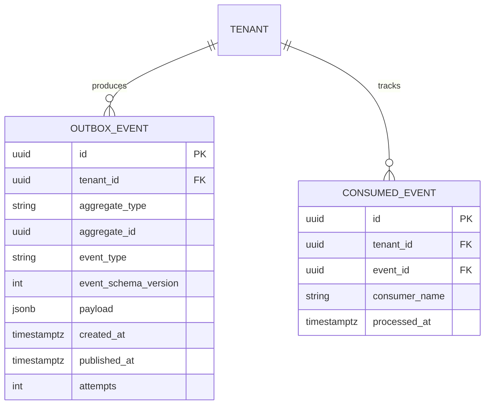
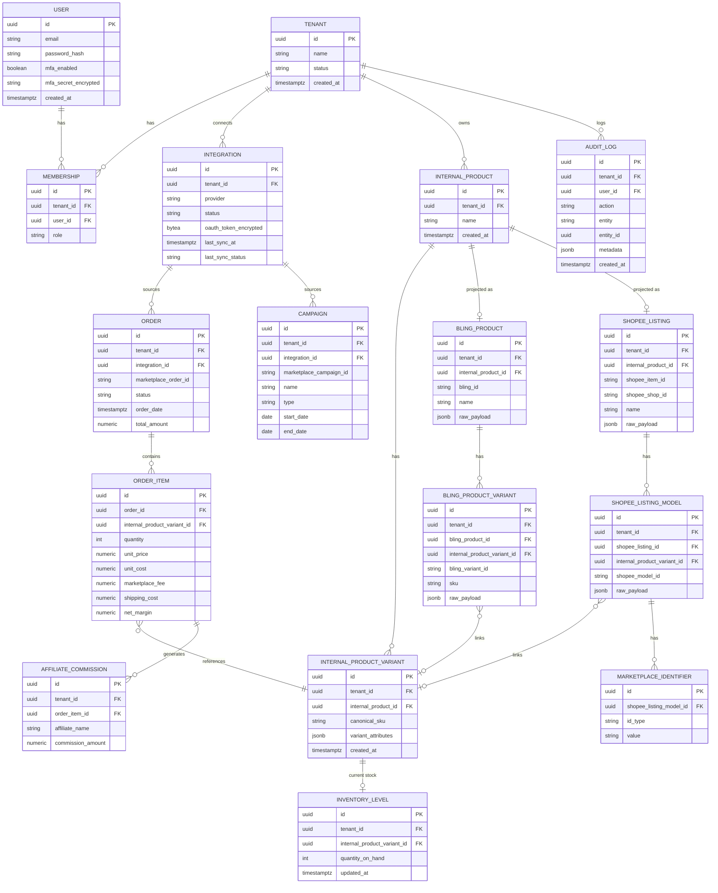
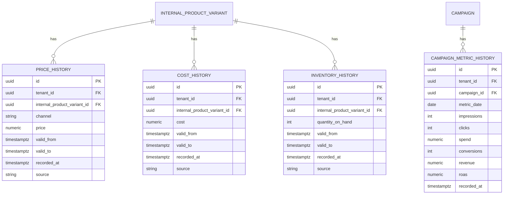
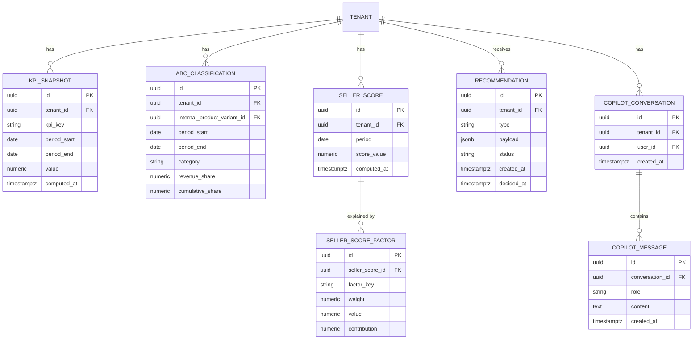

# Modelagem do Banco de Dados (ERD) — Seller Intelligence

Relacionado: [02-prd.md](./02-prd.md) · [03-architecture.md](./03-architecture.md) ·
[15-architecture-review.md](./15-architecture-review.md)

## 1. Organização em Schemas

O banco PostgreSQL é dividido em quatro schemas lógicos, refletindo diretamente o pipeline
da Intelligence Layer ([03-architecture.md](./03-architecture.md), seção 7):

| Schema | Papel | Mutabilidade |
|---|---|---|
| `platform` | Infraestrutura técnica transversal: Outbox de eventos, controle de idempotência de consumidores | Append-only (outbox) / atualização controlada (marcação de processado) |
| `core` | Estado atual das entidades (Operational Database) | Mutável (UPDATE representa o "agora") |
| `history` | Entity Timeline — versões passadas de entidades historizáveis | Append-only, imutável (RNF09) |
| `intelligence` | Saídas do Seller Intelligence Hub: KPIs, ABC/Pareto, Score, Recommendations, Copilot | Escrita apenas por jobs de recompute |

Toda tabela em todos os schemas carrega `tenant_id` (FK para `core.tenant`), inclusive as de
histórico e as de `platform` — isolamento multi-tenant não é exclusividade do schema
operacional (ver [09-multi-tenant-strategy.md](./09-multi-tenant-strategy.md)).

## 2. Padrão de Historização

Toda entidade listada no PRD (seção 7) segue o mesmo padrão estrutural entre sua tabela
`core` e sua tabela `history` correspondente:

- Tabela `core.<entidade>`: uma linha por entidade, sempre refletindo o estado atual.
- Tabela `history.<entidade>_history`: N linhas por entidade, cada uma com:
  - `valid_from` (timestamptz) — início da vigência do valor (tempo de negócio)
  - `valid_to` (timestamptz, nullable) — fim da vigência; `NULL` = ainda vigente
  - `recorded_at` (timestamptz) — momento em que o sistema capturou o valor (tempo de sistema)
  - `source` (enum: `shopee_sync` | `bling_sync` | `manual` | `system_recompute`)

Uma escrita em `core` que altera um valor historizável **sempre** insere uma nova linha em
`history` (fechando o `valid_to` da linha anterior) — nunca é feito UPDATE/DELETE em
`history`. Essa é a implementação concreta do RNF09. Tabelas de `history.*` de alto volume
(`price_history`, `cost_history`, `inventory_history`) são **particionadas por range mensal
de `recorded_at`, com sub-partição por hash de `tenant_id`**, desde a migration que as cria —
particionar depois que a tabela já tem dezenas de milhões de linhas exige janela de
manutenção; particionar desde o início não custa nada (Architecture Review, seção 5/R4).

## 3. Schema `platform`: Outbox e Idempotência de Consumidores

Suporta o padrão Transactional Outbox descrito em
[03-architecture.md](./03-architecture.md) §6 — resolve o risco R1 da Architecture Review.



- `outbox_event` é escrita **na mesma transação** que a tabela `core.*` alterada pelo caso de
  uso (ex.: `INSERT` em `core.order` + `INSERT` em `platform.outbox_event` no mesmo
  `COMMIT`) — é essa atomicidade que elimina o risco de evento perdido.
- `consumed_event` é o lado "Inbox" do padrão: cada consumidor (`consumer_name`) registra que
  já processou um `event_id` específico antes de agir, tornando o handler idempotente mesmo
  sob entrega at-least-once (retry do Outbox Relay).
- Nenhuma das duas tabelas tem FK `ON DELETE CASCADE` a partir de `core` — histórico de
  eventos sobrevive independentemente do ciclo de vida da entidade que os originou.

## 4. Diagrama ERD — Schema `core`

O Modelo Canônico de Produto (PRD §4) é modelado em **dois níveis**: produto (identidade
comercial, ex.: "Camiseta Azul") e variante (unidade efetivamente vendável/estocável, ex.:
"Camiseta Azul, tamanho M") — ver seção 5 para a justificativa completa. Toda referência de
pedido, estoque, preço e custo aponta para a **variante**, nunca para o produto pai
diretamente.



Nota sobre `ORDER`/`ORDER_ITEM`: um pedido é, por natureza, um fato imutável do passado (não
"muda de valor" como preço ou estoque) — por isso não tem tabela `history` espelhada; ele
próprio já é o registro histórico, e agregações por período são feitas via `order_date`.

## 5. Modelo de Variante de Produto

**Problema (Architecture Review, R6):** a versão anterior deste documento associava preço/
estoque/pedido diretamente a `InternalProduct`. Isso não reflete a realidade de Shopee
(cujos "items" têm "models" — variações de tamanho/cor, cada uma com SKU, preço e estoque
próprios) nem do Bling (que também versiona produto em variações). Modelar só no nível de
produto obrigaria, mais cedo ou mais tarde, uma migração dolorosa para introduzir variante.

**Decisão:** `InternalProduct` é a identidade comercial/canônica (o que o seller reconhece
como "um produto"); `InternalProductVariant` é a unidade real de venda/estoque/preço/custo.
**Todo produto tem no mínimo uma variante**, mesmo quando não há variação de fato (ex.:
produto sem grade de tamanho) — não existe caminho de código especial para "produto sem
variante": simplifica o domínio (`OrderItem`, `InventoryLevel`, `PriceHistory`,
`CostHistory` sempre referenciam `InternalProductVariant`, nunca precisam de um `CASE` para
"é produto simples ou variável").

As projeções externas seguem a mesma forma em dois níveis:

```
InternalProduct (identidade comercial)
    └── InternalProductVariant (unidade vendável/estocável)
            ▲                              ▲
            │ link opcional                │ link opcional
    BlingProductVariant              ShopeeListingModel
            │                              │
    BlingProduct (produto ERP)      ShopeeListing (anúncio)
                                            │
                                     MarketplaceIdentifier (item_id/model_id/SKU)
```

O matching automático (`ProductMatchingService`, [14-ddd-tactical-design.md](./14-ddd-tactical-design.md)
§4) passa a operar em nível de variante/SKU — o que já era a granularidade real usada para
casar produto Bling com anúncio Shopee (SKU), então este ajuste corrige o modelo para o que
o processo de negócio sempre exigiu, sem mudar a lógica de matching em si.

## 6. Diagrama ERD — Schema `history`



`CAMPAIGN_METRIC_HISTORY` e a futura `AFFILIATE_METRIC_HISTORY` usam grão diário
(`metric_date`) em vez de `valid_from`/`valid_to`, pois a fonte (Shopee Ads) já entrega
métricas em série diária — não há "vigência" a fechar, apenas acumulação de linhas por dia.

## 7. Diagrama ERD — Schema `intelligence`



`KPI_SNAPSHOT` é deliberadamente genérica (`kpi_key` + `value`) em vez de uma coluna por KPI:
os KPIs oficiais (PRD, seção 8) crescem ao longo do tempo, e uma tabela genérica evita
migração de schema a cada novo KPI — trade-off aceito é perder tipagem forte por linha,
compensado por validação na camada de aplicação (Pydantic) antes da escrita. Reavaliado no
Sprint 7 (ver registro de débito técnico em
[15-architecture-review.md](./15-architecture-review.md) §15) caso o padrão de consulta real
mostre custo de agregação alto o suficiente para justificar colunas fixas para os 14 KPIs
oficiais.

## 8. Dicionário de Entidades (resumo)

| Entidade | Schema | Descrição |
|---|---|---|
| `outbox_event` / `consumed_event` | platform | Transactional Outbox e controle de idempotência de consumidores |
| `tenant` | core | Empresa cliente (unidade de isolamento multi-tenant) |
| `user` / `membership` | core | Identidade global de usuário (com MFA) + vínculo com papel por tenant |
| `integration` | core | Conexão OAuth2 de um tenant com um provider (Shopee/Bling) |
| `internal_product` | core | Identidade comercial canônica do produto |
| `internal_product_variant` | core | Unidade canônica vendável/estocável (SKU); todo produto tem ≥1 variante |
| `bling_product` / `bling_product_variant` | core | Projeção ERP do produto e de suas variações |
| `shopee_listing` / `shopee_listing_model` | core | Projeção marketplace do anúncio e de seus modelos (variações) |
| `marketplace_identifier` | core | IDs específicos de marketplace (item_id, model_id, SKU) por variação |
| `order` / `order_item` | core | Pedidos consolidados, fato imutável, já com margem calculada, por variante |
| `inventory_level` | core | Estoque atual por variante |
| `campaign` | core | Campanha/anúncio identificado na origem |
| `affiliate_commission` | core | Comissão de afiliado associada a um item de pedido |
| `audit_log` | core | Trilha de auditoria de ações relevantes |
| `price_history` / `cost_history` / `inventory_history` | history | Entity Timeline de preço, custo e estoque, por variante |
| `campaign_metric_history` | history | Série diária de métricas de campanha/anúncio |
| `kpi_snapshot` | intelligence | Valor de um KPI oficial por período |
| `abc_classification` | intelligence | Classificação ABC de uma variante por período |
| `seller_score` / `seller_score_factor` | intelligence | Score consolidado e fatores explicativos |
| `recommendation` | intelligence | Recomendação proativa gerada pelo Recommendation Engine |
| `copilot_conversation` / `copilot_message` | intelligence | Histórico de interações com o Seller Copilot |

## 9. Índices e Constraints Críticos (multi-tenant)

- Toda tabela com `tenant_id` tem índice composto `(tenant_id, <chave de consulta mais
  comum>)` — ex.: `(tenant_id, order_date)` em `order`, `(tenant_id, period_start)` em
  `kpi_snapshot`.
- Row-Level Security (RLS) habilitado em todas as tabelas de todos os quatro schemas, com
  policy **fail-closed** — detalhado em
  [09-multi-tenant-strategy.md](./09-multi-tenant-strategy.md) (redesenhado para
  compatibilidade com connection pooling).
- `history.*` e `intelligence.*` não têm FK de `ON DELETE CASCADE` a partir de `core` —
  deletar/inativar uma entidade em `core` não pode apagar seu histórico (RNF09).
- `history.price_history`, `history.cost_history`, `history.inventory_history` são
  particionadas por mês de `recorded_at` desde a migration inicial (seção 2).
- `platform.outbox_event` tem índice parcial `WHERE published_at IS NULL` — a fila de
  pendentes deve ser pequena e rápida de escanear independente do tamanho histórico total da
  tabela.
