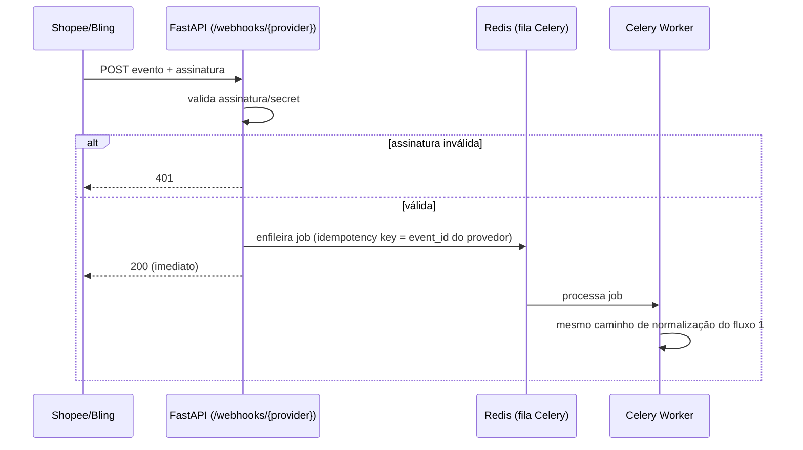
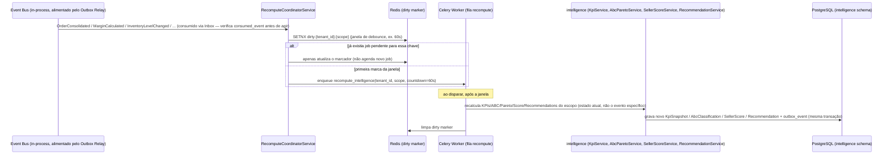
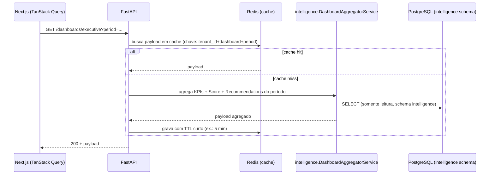
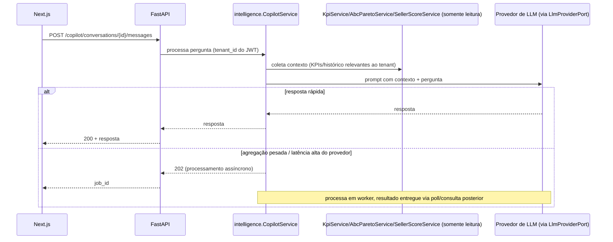

# Data Flow — Seller Intelligence

Relacionado: [03-architecture.md](./03-architecture.md) §7 · [06-modules.md](./06-modules.md)

Este documento detalha, em nível de sequência, os fluxos que a visão de pipeline em
[03-architecture.md](./03-architecture.md) §7 descreve de forma conceitual. Cada fluxo
declara explicitamente a fronteira síncrono/assíncrono e a estratégia de falha — essa
fronteira é uma decisão arquitetural, não um detalhe de implementação: tudo que toca uma
API externa (Shopee/Bling/LLM) é assíncrono por padrão; tudo que serve uma tela ao usuário é
síncrono com orçamento de latência definido (RNF03: P95 < 2s).

## 1. Sincronização Agendada (Celery Beat)

```mermaid
sequenceDiagram
    participant Beat as Celery Beat
    participant Worker as Celery Worker (fila sync.{provider})
    participant Limiter as RateLimiterPort (redis-broker)
    participant Adapter as ShopeeAdapter/BlingAdapter
    participant Ext as API Externa
    participant DB as PostgreSQL (core + history + outbox)
    participant Relay as Outbox Relay

    Beat->>Worker: enqueue sync_integration(tenant_id, integration_id)
    Worker->>DB: BEGIN; SET LOCAL app.tenant_id (tenant_context, §9 de 09-multi-tenant-strategy.md)
    Worker->>Limiter: acquire_global(provider) + acquire_tenant(provider, tenant_id)
    alt sem token disponível
        Limiter-->>Worker: negado
        Worker->>Worker: reenfileira com delay (não bloqueia o worker)
    else token concedido
        Worker->>Adapter: fetch_products/orders/inventory/campaigns()
        Adapter->>Ext: chamada HTTP autenticada (OAuth2)
        Ext-->>Adapter: payload bruto
        Adapter->>Adapter: normaliza para modelo canônico
        Adapter->>DB: upsert em core.* + insere versão em history.* (se valor mudou) + INSERT em platform.outbox_event — mesma transação
        Worker->>DB: COMMIT
        Worker->>DB: grava SyncLog (status, contagem, erros)
        Relay->>DB: poll outbox_event WHERE published_at IS NULL
        Relay->>Relay: publica ProductIngested / OrderIngested / InventorySnapshotIngested / CampaignMetricIngested no bus in-process
        Relay->>DB: marca published_at
    end
```

**Falhas:** erro de rede/rate-limit no adapter → retry com backoff exponencial (máx. N
tentativas, configurável por provider). Esgotadas as tentativas, `SyncLog` registra
`status=failed` com motivo, visível em `/integrations/{id}/sync-logs` (RF07) — nunca falha
silenciosa em log de servidor apenas. Se o worker morrer **depois** do `COMMIT` (agregado +
outbox) mas antes de qualquer publicação, o evento não se perde: o Outbox Relay o encontra
na próxima varredura (`published_at IS NULL`) — esta é exatamente a garantia que resolve o
risco R1 da Architecture Review.

## 2. Webhook (Push da Shopee/Bling)



**Decisão:** o handler HTTP nunca processa o payload de negócio de forma síncrona — apenas
valida e enfileira. Isso limita o tempo de resposta ao provedor (que frequentemente impõe
timeout curto e desativa o webhook após falhas repetidas) e reaproveita o mesmo caminho de
normalização/idempotência do sync agendado, evitando dois caminhos de código divergentes
para o mesmo dado.

## 3. Sincronização Manual (RF06)

Idêntica ao fluxo 1, exceto que o gatilho é uma requisição do usuário
(`POST /integrations/{id}/sync`) em vez do Celery Beat. A API responde `202 Accepted`
imediatamente com o job enfileirado; o usuário acompanha o progresso consultando
`/integrations/{id}/sync-logs` (poll) — não há WebSocket no MVP por simplicidade, revisitado
se a experiência de espera se mostrar um problema real de UX.

## 4. Recompute da Camada de Inteligência (event-driven, com debounce)



**Decisão de escopo incremental:** o recompute é escopado ao que o evento afeta (ex.:
`ProductPriceChanged` recalcula margem/KPI do produto e do período corrente, não todo o
histórico do tenant) — recompute completo (todos os períodos) é uma operação separada,
disparada manualmente ou em job de manutenção, não a cada evento.

**Decisão de debounce (resolve R5 da Architecture Review):** múltiplos eventos do mesmo
`(tenant_id, scope)` dentro da janela de 60s resultam em **um único** job de recompute, não
um por evento — essencial para tenants de alto volume de pedidos, onde 1 evento = 1 job
geraria uma tempestade de jobs redundantes. Trade-off aceito: KPI/Score podem ficar até 60s
desatualizados após a última alteração, compatível com a natureza do produto (não é um
sistema de decisão em tempo real de milissegundos).

## 5. Leitura de Dashboard (síncrono, orçamento de latência)



**Decisão:** dashboards leem exclusivamente do schema `intelligence` (dados já
pré-computados pelo fluxo 4), nunca agregam `core`/`history` em tempo de request — é o que
sustenta o RNF03 (P95 < 2s) independente do volume de pedidos históricos do tenant. Cache
Redis com TTL curto absorve picos de acesso ao mesmo dashboard sem reprocessar o agregador a
cada request.

## 6. Seller Copilot (síncrono com fallback assíncrono)



**Garantia de isolamento (RF18):** o contexto montado por `Hub` para o `CopilotService` é
sempre resolvido a partir do `tenant_id` do JWT autenticado — o prompt enviado ao provedor de
LLM nunca inclui, nem por engano, dado de outro tenant, pois `Hub` já opera com a mesma
sessão de banco com RLS ativo (ver [09-multi-tenant-strategy.md](./09-multi-tenant-strategy.md)).

## 7. Resumo das Fronteiras Síncrono/Assíncrono

| Fluxo | Síncrono | Assíncrono |
|---|---|---|
| Ingestão (agendada, webhook, manual) | Validação/enfileiramento + rate limit check | Chamada à API externa + normalização + escrita + publicação via Outbox Relay |
| Recompute de inteligência | — | Sempre (disparado por evento, com debounce de 60s) |
| Leitura de dashboard | Sempre (lê pré-computado + cache) | — |
| Copilot | Caminho feliz (pergunta simples) | Fallback para agregação pesada |

## 8. Garantias de Confiabilidade (resumo)

| Garantia | Mecanismo |
|---|---|
| Evento nunca perdido entre commit e publicação | Transactional Outbox (fluxo 1, seção 6 de [03-architecture.md](./03-architecture.md)) |
| Evento processado no máximo uma vez por efeito | `consumed_event` (Inbox) verificado por todo handler antes de agir |
| Chamada a Shopee/Bling nunca ultrapassa limite agregado | `RateLimiterPort` (fluxo 1, seção 11 de [03-architecture.md](./03-architecture.md)) |
| Recompute não gera tempestade de jobs em alto volume | Debounce/coalescing por `(tenant_id, scope)` (fluxo 4) |
| Contexto de tenant nunca vaza entre transações no pool | `SET LOCAL` por transação ([09-multi-tenant-strategy.md](./09-multi-tenant-strategy.md)) |
